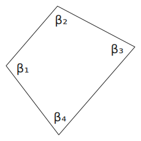

# Вычисление поправок в измерения

$$
\Sigma_{practice} =\beta_1 + \beta_2 + \beta_3 + \beta_4
$$

$$
\Sigma_{theory} =180^{\circ} \cdot (N - 2) 
$$

$$
f_\beta = \Sigma_{practice} - \Sigma_{theory}
$$

Рассмотрим пример, когда углы измерены с точностью до 1 знака после запятой:

$$
\Sigma_{practice} = 359^{\circ} 59.1'
$$

$$
\Sigma_{theory} =180^{\circ} \cdot (4 - 2) = 360^{\circ} 
$$

$$
f_\beta = -0.9' 
$$

## Алгоритм поиска поправок (ликвидации невязки)

1. Перед вычислением поправки в первый угол найдём значение первого вспомогательного значения $k_1$ путём деления невязки на количество углов $N = 4$:

$$
k_1 = \frac{f_\beta}{N}=\frac{-0.9'}{4}=-0.225
$$

2. Выполним округление $k_1$ также до 1 знака после запятой по "школьным" правилам округления:

$$
k_1 = -0.2|25 = -0.2'
$$

3. Поправка в угол $\beta_1$ равна значению $k_1$, взятому с противоположным знаком:

$$
V_1 = -k_1 = -(-0.2') = 0.2'
$$

4. Значение оставшейся (неликвидированной) части невязки:

$$
f_\beta^{(1)} = f_\beta + V_1 = -0.9' + 0.2' = -0.7'
$$

5. Вычислим второе вспомогательное значение $k_2$, разделив оставшуюся часть невязки $f_\beta^{(1)}$ на количество оставшихся углов $N^{(1)}=N-1=3$:

$$
k_2 = \frac{f_\beta^{(1)}}{N^{(1)}}=\frac{-0.7'}{3}=-0.233(3)
$$

6. Выполним округление $k_2$ также до 1 знака после запятой:

$$
k_2 = -0.2|33(3) = -0.2' = -0.2'
$$

7. Поправка в угол $\beta_2$ равна значению $k_2$, взятому с противоположным знаком:

$$
V_2 = -k_2 = -(-0.2') = 0.2'
$$

8. Значение оставшейся (неликвидированной) части невязки:

$$
f_\beta^{(2)} = f_\beta^{(1)} + V_2 = -0.7' + 0.2' = -0.5'
$$

9. Вычислим третье вспомогательное значение $k_3$, разделив оставшуюся часть невязки $f_\beta^{(2)}$ на количество оставшихся углов $N^{(2)}=N^{(1)}-1=2$:

$$
k_3 = \frac{f_\beta^{(2)}}{N^{(2)}}=\frac{-0.5'}{2}=-0.25
$$

10. Выполним округление $k_3$ до 1 знака после запятой:

$$
k_3 = -0.2|5 = -0.3'
$$

11. Поправка в угол $\beta_3$ равна значению $k_3$, взятому с противоположным знаком:

$$
V_3 = -k_3 = -(-0.3') = 0.3'
$$

12. Значение оставшейся (неликвидированной) части невязки:

$$
f_\beta^{(3)} = f_\beta^{(2)} + V_3 = -0.5' + 0.3' = -0.2'
$$

13. Вычислим четвёртое вспомогательное значение $k_4$, разделив оставшуюся часть невязки $f_\beta^{(3)}$ на количество оставшихся углов $N^{(3)}=N^{(2)}-1=1$:

$$
k_4 = \frac{f_\beta^{(3)}}{N^{(3)}}=\frac{-0.2'}{1}=-0.2
$$

14. Поправка в угол $\beta_4$ равна значению $k_4$, взятому с противоположным знаком:

$$
V_4 = -k_4 = -(-0.2') = 0.2'
$$

15. **Проверка**. Сумма поправок равна невязке с противоположным знаком:

$$
V_1 + V_2 + V_3 + V_4 = -f_\beta 
$$

$$
0.2' + 0.2' + 0.3' + 0.2' = -(-0.9') 
$$

$$
0.9' = 0.9'
$$
